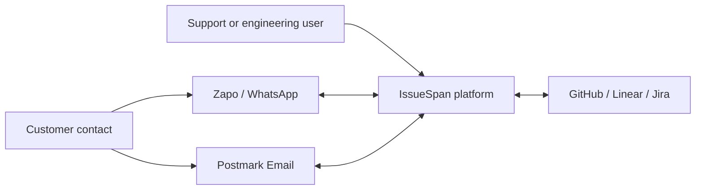
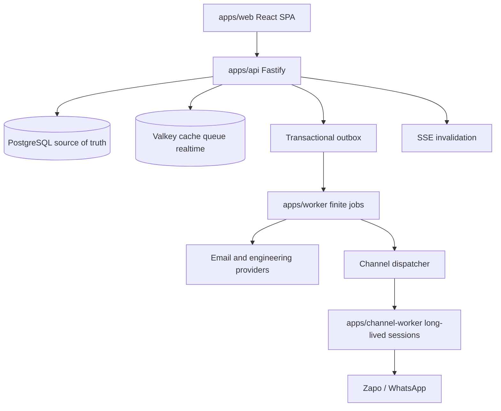
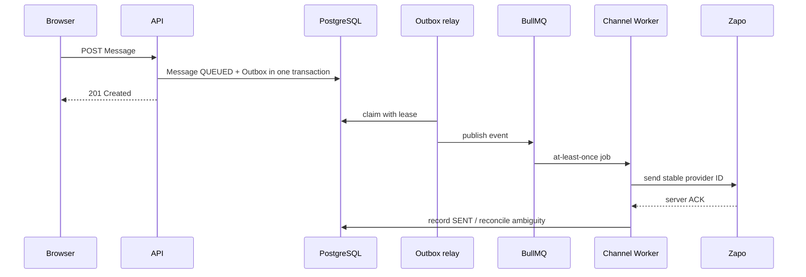
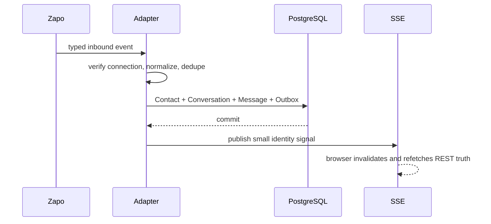
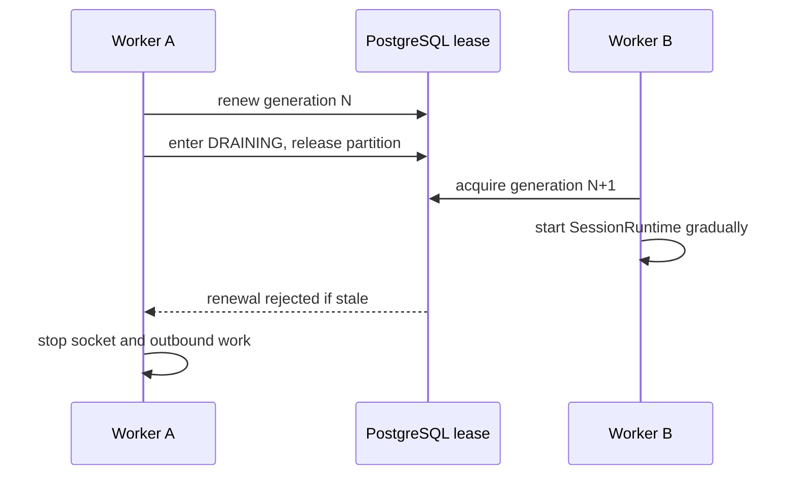
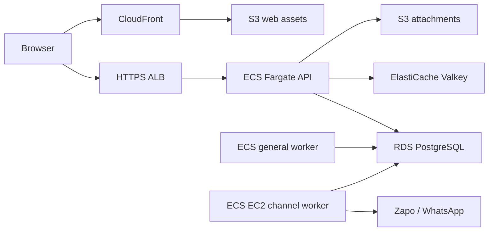

# Architecture diagrams

Status: **CURRENT explanatory diagrams; implementation planned.**

## C4 context

## C4 containers

## Outbound Message

## Inbound Message

## Channel ownership handoff

## Cloud deployment

